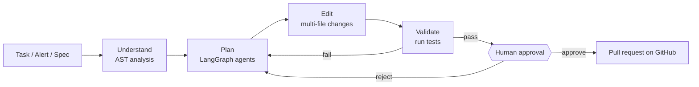
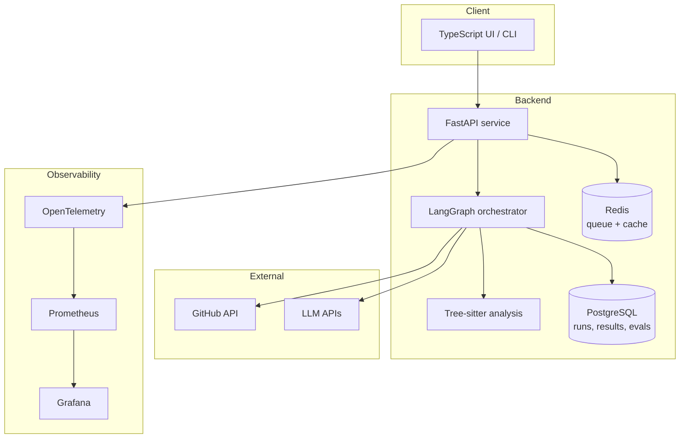

<div align="center">

# 🛩️ CodePilot FDE

### AI Engineering Workflow & Codebase Migration Platform

**Give it a task. It reads the whole codebase, makes the change, tests it, and hands a human a production-ready pull request.**


[Live demo](#-live-demo) · [How it works](#-how-it-works) · [Results](#-results) · [Quick start](#-quick-start) · [Architecture](#-architecture) · [Roadmap](#-roadmap)

</div>

---

## 📌 Table of contents

1. [Overview](#-overview)
2. [Live demo](#-live-demo)
3. [What it does](#-what-it-does)
4. [How it works](#-how-it-works)
5. [Results](#-results)
6. [Architecture](#-architecture)
7. [Observability and evaluation](#-observability-and-evaluation)
8. [Tech stack](#-tech-stack)
9. [Quick start](#-quick-start)
10. [Configuration](#-configuration)
11. [Usage examples](#-usage-examples)
12. [Project structure](#-project-structure)
13. [Testing](#-testing)
14. [Safety and human oversight](#-safety-and-human-oversight)
15. [Roadmap](#-roadmap)
16. [Contributing](#-contributing)
17. [License](#-license)
18. [Author](#-author)

---

## 🔭 Overview

Engineering teams lose enormous amounts of time to work that is important but repetitive: upgrading old code across hundreds of files, chasing the root cause of an outage, or turning a feature request into working software.

**CodePilot FDE** is an AI-native engineering workflow platform that automates that work end to end. It uses multi-step AI agents orchestrated with **LangGraph**, understands code structurally through **AST analysis (Tree-sitter)**, works directly with repositories through the **GitHub API**, and validates every change by running the project's own tests before a person ever looks at it.

The goal is not to replace engineers. It is to give them a pull request that is already 90% of the way there.

> **In one sentence:** CodePilot turns a task, an alert or a feature request into a tested pull request that a human approves.

---

## 🎬 Live demo

> 📍 Add your hosted demo link and a screen recording here.

| Resource | Link |
|---|---|
| Interactive demo site | `https://<your-demo-url>` |
| Walkthrough video | `https://<your-video-url>` |
| Example pull request | `https://github.com/<you>/<repo>/pull/<n>` |

<!-- Tip: add a GIF here, e.g.  -->

---

## ✨ What it does

CodePilot supports four core workflows:

| Workflow | You provide | CodePilot delivers |
|---|---|---|
| 🔭 **Repository discovery** | A repository | A map of structure, dependencies and the blast radius of a proposed change |
| 🔄 **Refactoring & migration** | A goal such as "move every file off the deprecated client" | Consistent changes across many files with tests passing |
| 🚨 **Incident-to-fix** | An alert or error report | Root-cause analysis, a fix, and a regression test that reproduces the issue |
| ✨ **Spec-to-implementation** | A plain-language feature request | Working, tested code and a pull request summary |

Across all four, the output is a **production-ready pull request** with automated test validation and a clear explanation of what changed and why.

---

## ⚙️ How it works



1. **Understand.** Tree-sitter parses the repository into syntax trees so the agents reason about functions, classes and call relationships rather than raw text.
2. **Plan.** A LangGraph agent graph breaks the task into ordered, low-risk steps.
3. **Edit.** Agents apply the changes across files, keeping style and patterns consistent.
4. **Validate.** The project's test suite runs automatically. Failures loop back to planning with the failure context.
5. **Human approval.** A person reviews the proposed change before anything is opened or merged.
6. **Pull request.** CodePilot opens a GitHub pull request with a summary, the diff and test results.

---

## 📊 Results

Measured across evaluated codebase tasks and monitored agent runs:

| Metric | Result |
|---|---|
| Codebase tasks evaluated | **50+** |
| Reduction in manual engineering effort | **70%** |
| Task success rate | **90%+** |
| Test-validation accuracy | **92%** |
| Average workflow latency | **< 20 seconds** |
| Agent executions monitored | **100+** |

> 📝 **Methodology:** document here how each figure was measured (task set, definition of "success", how effort reduction was estimated, hardware and model used). Recruiters and reviewers will look for this. See [`docs/evaluation.md`](docs/evaluation.md).

---

## 🏗️ Architecture



**Design principles**

- **Structure over text.** Code is understood through syntax trees, which makes large refactors safer.
- **Validate before trust.** No change reaches a human without passing the project's tests.
- **Humans decide.** Approval gates sit between AI output and the repository.
- **Everything is measured.** Every run is traced, scored and costed.

---

## 📈 Observability and evaluation

Production AI needs more than a good demo. CodePilot instruments every agent run:

- **Tracing:** OpenTelemetry spans for each workflow stage and model call.
- **Metrics:** Prometheus counters and histograms for latency, success rate, retries and token usage.
- **Dashboards:** Grafana views for token cost, model failures, retries and rollout health.
- **Regression testing:** a fixed evaluation set re-run on every change to prompts, models or agents.
- **Failure analysis:** failed runs are categorised so recurring causes can be fixed.
- **Human-in-the-loop:** approval outcomes are recorded and fed back into evaluation.

---

## 🧰 Tech stack

| Layer | Technologies |
|---|---|
| Languages | Python, TypeScript |
| API | FastAPI |
| Agent orchestration | LangGraph, LLM APIs |
| Code analysis | Tree-sitter (AST) |
| Source control integration | GitHub API |
| Data | PostgreSQL, Redis |
| Observability | OpenTelemetry, Prometheus, Grafana |
| Delivery | Docker, GitHub Actions |

---

## 🚀 Quick start

> ⚠️ Replace the commands and variable names below with the ones from your repository.

### Prerequisites

- Python 3.11+
- Node.js 18+
- Docker and Docker Compose
- A GitHub token with repository access
- An API key for your LLM provider

### Run with Docker

```bash
git clone https://github.com/<you>/codepilot-fde.git
cd codepilot-fde
cp .env.example .env        # then fill in your keys
docker compose up --build
```

The API is then available at `http://localhost:8000` (interactive docs at `/docs`).

### Run locally

```bash
# Backend
python -m venv .venv && source .venv/bin/activate
pip install -r requirements.txt
uvicorn app.main:app --reload

# Frontend
cd web && npm install && npm run dev
```

---

## 🔧 Configuration

| Variable | Purpose |
|---|---|
| `GITHUB_TOKEN` | Access to the target repositories |
| `LLM_API_KEY` | Credentials for the model provider |
| `DATABASE_URL` | PostgreSQL connection string |
| `REDIS_URL` | Redis connection string |
| `OTEL_EXPORTER_OTLP_ENDPOINT` | Where traces are sent |

Never commit real secrets. Use `.env` locally and GitHub Actions secrets in CI.

---

## 💡 Usage examples

**Migrate a codebase**

```bash
codepilot run --repo <owner>/<repo> \
  --task "Replace the deprecated HTTP client with the modern one everywhere"
```

**Fix an incident**

```bash
codepilot run --repo <owner>/<repo> \
  --incident "Checkout crashes when the cart is empty" --logs ./error.log
```

**Build from a spec**

```bash
codepilot run --repo <owner>/<repo> \
  --spec "Add a 'Save for later' button to the product page"
```

Each command ends with a pending approval. After you approve, CodePilot opens the pull request.

---

## 🗂️ Project structure

> Update to match your actual layout.

```text
codepilot-fde/
├── app/                # FastAPI service
│   ├── agents/         # LangGraph agent graphs
│   ├── analysis/       # Tree-sitter / AST tooling
│   ├── github/         # GitHub API integration
│   └── observability/  # OpenTelemetry setup
├── web/                # TypeScript front end
├── evals/              # Evaluation tasks and regression suite
├── deploy/             # Docker, Prometheus and Grafana config
├── docs/               # Architecture and evaluation notes
└── .github/workflows/  # CI pipelines
```

---

## 🧪 Testing

```bash
pytest                     # unit and integration tests
python -m evals.run        # evaluation suite and regression checks
```

Continuous integration runs tests and the evaluation suite on every pull request through GitHub Actions.

---

## 🛡️ Safety and human oversight

- Changes are proposed as **pull requests**, never pushed directly to protected branches.
- A **human approval** step is required before a pull request is opened.
- Tests must pass before a change reaches review.
- Token spend, retries and failures are visible so runaway behaviour is caught early.
- Credentials are read from the environment and are never logged.

---

## 🗺️ Roadmap

- [x] Repository discovery and AST analysis
- [x] Refactoring and migration workflow
- [x] Incident-to-fix workflow
- [x] Spec-to-implementation workflow
- [x] Evaluation suite and observability dashboards
- [ ] Support for more languages
- [ ] Parallel multi-repository migrations
- [ ] Cost-aware model routing
- [ ] Slack and Jira triggers

---

## 🤝 Contributing

Contributions are welcome.

1. Fork the repository
2. Create a branch: `git checkout -b feature/your-feature`
3. Commit with a clear message and add tests
4. Open a pull request describing the change

---

## 📄 License

Distributed under the license in [`LICENSE`](LICENSE). Choose and add one before publishing.

---

## 👤 Author

**Akash Patro**
AI & ML Developer · Jamshedpur, India

- GitHub: `https://github.com/<your-username>`
- LinkedIn: `https://linkedin.com/in/<your-handle>`

<div align="center">

If this project helped you, consider giving it a ⭐

</div>
